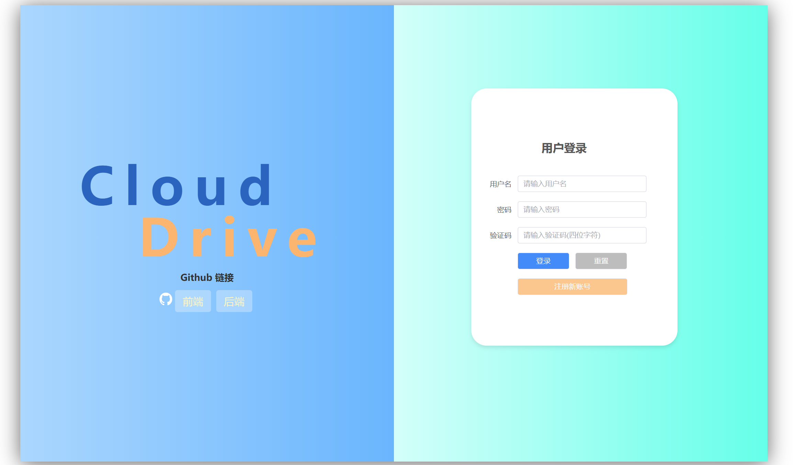
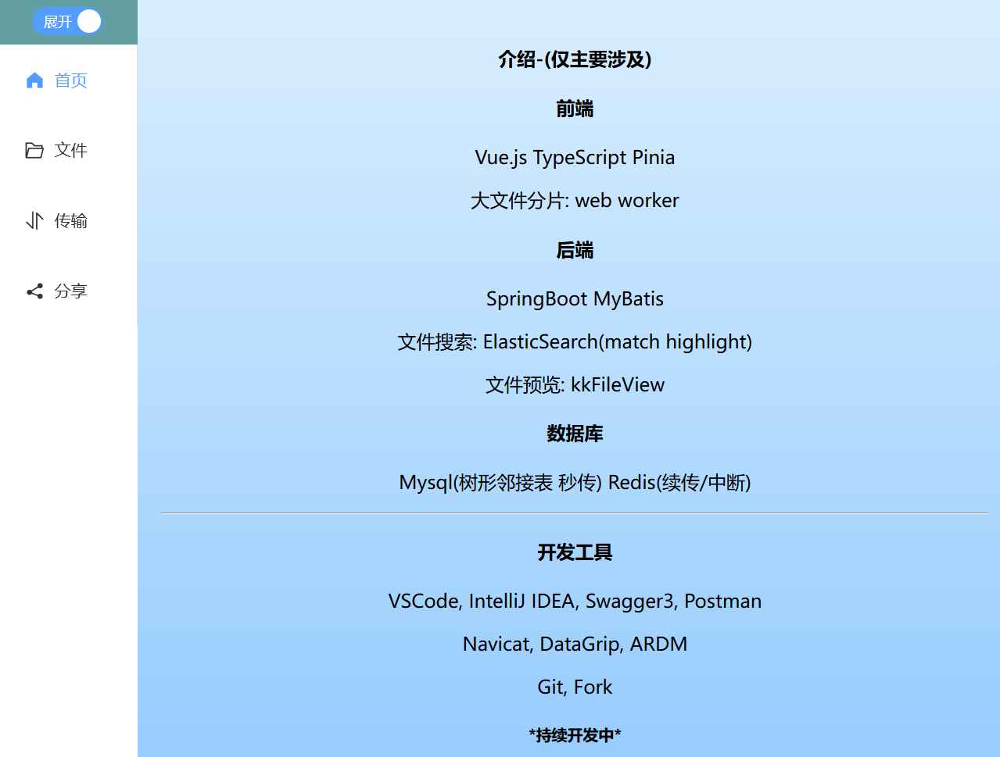
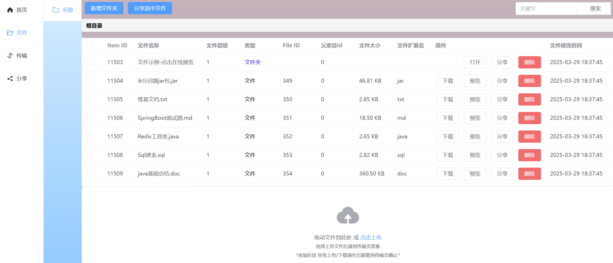
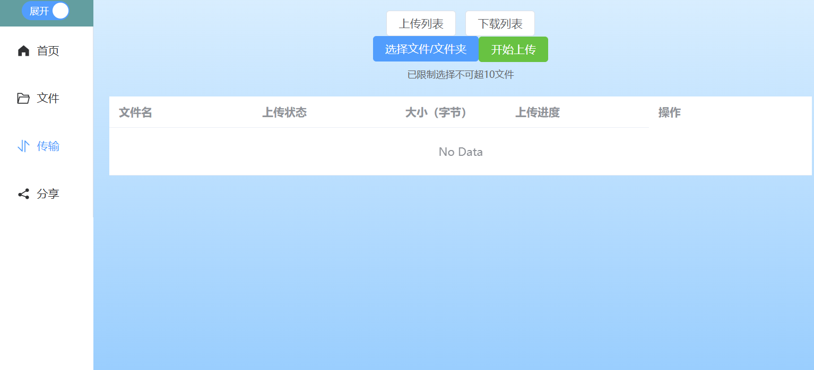

# :cloud: Cloud Drive - Frontend

**Cloud Drive** 云存储服务 **前端** 交互页

> Cloud Drive 是一款基于网页的云存储应用，重现了现代主流云存储服务的大部分常用功能。用户借助它能够轻松存储、访问、管理和分享各类文件，涵盖文档、照片、视频、音乐以及压缩文件等。只需通过网页浏览器，就可以在不同地点和设备上管理这些文件。

<b>在线体验👉：[https://cloud.softspark.cn](https://cloud.softspark.cn)</b> **本项目持续开发中，故可能不定期维护。可直接访问下方后端链接中功能演示部分。*

<b>项目后端：[https://github.com/AsihanBit/cloud-drive-backend](https://github.com/AsihanBit/cloud-drive-backend)</b>
测试 :link: :link:：<b>:link:</b>
:link:

# :sparkles: 亮点

- 本前端项目基于 Vue.js 构建，参考了主流网盘的功能页面，实现了用户对于网盘应用的大部分操作需求。
- **Pinia 状态管理：** 项目中主要用于管理包括文件上传/下载，用户信息在内的各种状态，高效追踪文件操作的实时状态。以及把文件分片化处理（如断点续传等）部分业务重现在用户浏览器（B 端），以减少与后端服务器的频繁交互，减轻后端服务器的压力（S 端），并且可以做到比完全依赖后端更快的处理。
- **Web Worker 多线程技术：** 允许在浏览器中创建独立于主线程的多个后台线程，避免了在处理大文件分片时阻塞主线程，保证了页面的流畅性。线程数量会根据 Web API 提供的属性根据用户设备可用的处理器核心数量进行调整，合理利用设备资源。

# :page_with_curl: 页面介绍

| 名称 |                            预览图                            |
| :--------------------: | :----------------------------------------------------------: |
|        登录页面        |   |
|          主页          |    |
|        文件列表        |    |
|        文件传输        |  |

此处仅展示了部分页面。

**开发主要聚焦于功能搭建，页面美化投入较少，仍尚存在优化空间，欢迎提供意见建议。*

# :star2: 功能介绍

#### 🔒 用户权限：使用 JWT 实现用户认证和权限控制。

####  :file_folder: 空间管理：用户可以按层级管理存储文件，采用了树形邻接表存储目录信息。

#### 🌐 文件传输：Web Worker 进行文件分片，支持分片并发上传，暂停，续传，秒传等。

#### 🔍 文件搜索：实现了ElasticSearch 搜索，关键字高亮显示 (match highlight) 。

#### 📄 在线浏览：集成了 kkFileView 可以浏览多数格式文件（逐步完善中）。

#### :mailbox_with_mail: 文件分享：支持多个 文件/文件夹 分享，转存。分享码采用 AES​ 对称加密，保障用户群体分享的资源不会被爬取。

#### 💬 ··· 更多功能开发中 ···

# 🔔 其他说明

### :chart_with_upwards_trend: 进度

项目处于开发阶段，各项功能仍在开发中。

### :vibration_mode: 适配

**\*主要对 PC Web端开发，目前仅登录页面适配了移动端\***

